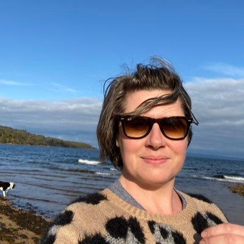

Since 2014, the #sleepyteens project at the University of Glasgow has been dedicated to looking beyond the headlines to present the evidence on adolescent social media use and sleep.

---

Dr Heather Cleland Woods is a Senior Lecturer in the School of Psychology. Blurb

---

Dr Holly Scott is a Lecturer in the School of Psychology. Her PhD examined the cognitive and emotional factors that can make it difficult for young people to disengage from social media at bedtime. She is interested in how schools can support pupil wellbeing through research partnerships.

---