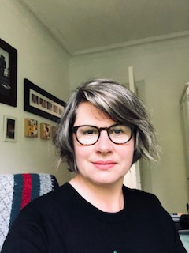
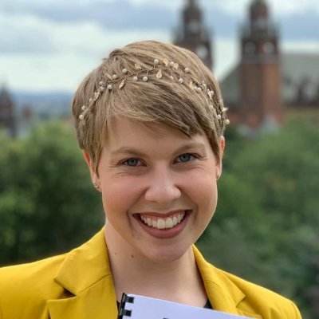

Since 2014, the #sleepyteens project at the University of Glasgow has been dedicated to looking beyond the headlines to present the evidence on adolescent social media use and sleep.

---

Dr Heather Cleland Woods is a Senior Lecturer in the School of Psychology at the University of Glasgow. She runs the #sleepyteens project which seeks to understand how young people use social media and its impact on social connectedness and health. She has contributed to UK government reports on screen time and health in young people and is published in highly regarded academic and non-academic publications such as the BMJ and The Conversation. You can follow her on Twitter @clelandwoods.

---

Dr Holly Scott is a Lecturer in the School of Psychology at the University of Glasgow. Her PhD examined the cognitive and emotional factors that can make it difficult for young people to disengage from social media at bedtime. She is interested in how schools can support pupil wellbeing through research partnerships. You can follow her on Twitter @hollyscott248

---